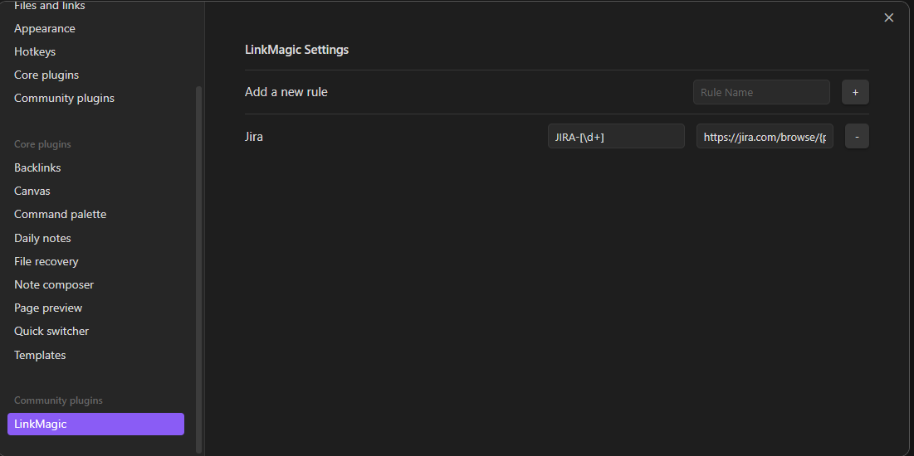

# LinkMagic Plugin for Obsidian

The LinkMagic Plugin for Obsidian is a convenient tool designed to simplify the process of adding links to your notes in Obsidian. With LinkMagic, you can define custom Regex Patterns and automatically insert links as you type, without needing to switch between editing and reading modes.
# Key Features

  - Regex Pattern Matching: Define custom Regex Patterns to identify specific text strings in your notes.
  - Automatic Link Insertion: Once a Regex Pattern is matched, LinkMagic automatically inserts the defined link.
  - Works in Editing Mode: Unlike some other plugins, LinkMagic works seamlessly within the editing mode, saving you time and enhancing your workflow.
  - Customizable: Configure your Regex Patterns and corresponding links in the plugin's settings page to tailor it to your needs.

Usage

  1. Installation: Install the LinkMagic Plugin from the Obsidian Community Plugins tab.
  2. Configuration: Navigate to the plugin settings page to define your Regex Patterns and corresponding links.
  3. Usage: As you type in the editing mode, LinkMagic will detect the defined patterns and automatically insert the associated links when you press space or enter (tab support will be added in future updates).

# Example

## Configuring a Jira Link Replacer Rule

To create a rule that automatically converts Jira issue keys into clickable links:

  1. Create a New Rule: In the LinkMagic settings, add a new rule.
  2. Define the Pattern: Specify the pattern that will trigger the replacement. For my example Jira instance issue keys, use the regular expression JIRA-[\d+] to match any text starting with "JIRA-" followed by one or more digits.
  3. Set the Replacement: Determine the URL template to which the matched text will be replaced. For Jira, use https://jira.com/browse/{pattern}, where {pattern} will be replaced with the captured issue key.

# Support and Feedback

If you encounter any issues or have suggestions for improving LinkMagic, please feel free to [open an issue](https://github.com/AndyReifman/MagicLink/issues) on GitHub.

# License

LinkMagic is released under the [MIT License](LICENSE).